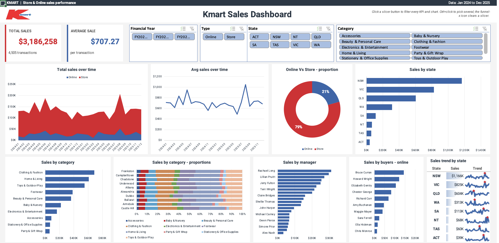

# Kmart Sales Dashboard (Excel)

An interactive, single-screen sales dashboard for a national retailer, built entirely in native Excel: pivot tables, pivot charts, slicers, sparklines and a filled map. Store managers and category leads can check performance at a glance, and one slicer click filters every KPI and chart at once.



> Training project. The dataset and brand guidelines were provided for educational purposes. This project is not affiliated with or endorsed by Kmart.

---

## The brief

Turn 4,505 raw retail transactions (Jan 2024 – Dec 2025) into a dashboard that:

- shows **Total Sales** and **Average Sale** KPIs that update with every filter
- breaks sales down by time, channel (Online vs Store), category, suburb, manager, buyer and state
- filters everything from four slicers: **Financial Year, Type, State, Category**
- stays fully **live**, with no hardcoded totals, so it recalculates when the data changes
- fits on **one screen** and follows the brand guidelines (colours, Roboto font, logo placement)

## Key findings (full dataset)

| Metric | Value |
|---|---|
| Total sales | $3,186,258 |
| Transactions | 4,505 |
| Average sale | $707.27 |
| Channel mix | Store 79% · Online 21% |
| Largest state | NSW ($1.17M, 37% of sales) |
| Largest category | Clothing & Fashion ($686K) |

- **Stores drive both volume and basket size.** The average store sale (~$791) is about 57% higher than the average online sale (~$503).
- **Sales are concentrated on the east coast.** NSW, VIC and QLD together account for about 81% of revenue.
- **Three categories carry the business.** Clothing & Fashion, Home & Living and Toys & Outdoor Play together make up about 58% of sales.

## Dashboard contents

| Visual | Type | What it answers |
|---|---|---|
| Total Sales / Average Sale | KPI cards | Headline performance for the current filter |
| Total sales over time | Stacked area (Online vs Store) | How each channel trends month by month |
| Avg sales over time | Line | Is basket size growing or shrinking? |
| Sales by category | Horizontal bar | Which categories carry the business |
| Sales by category - proportions | 100% stacked bar | Category mix in the top 10 suburbs |
| Online Vs Store - proportion | Doughnut | Channel split |
| Sales by manager | Ranked bar | Manager performance league table |
| Sales by buyers - online | Ranked bar | Which buyers' ranges sell online |
| Sales by state | Filled map | Geographic distribution |
| Sales trend by state | Sparkline table + data bars | Each state's monthly trend at a glance |

## How it's built

```
Raw Data (Unclean) ──► KMART DATA (cleaned Excel table)
                              │
                              ▼
                  One shared pivot cache
                              │
          ┌───────────────────┼──────────────────────┐
          ▼                   ▼                      ▼
   10 pivot tables     GETPIVOTDATA formulas    4 slicers
   (one per visual)    (KPIs, map, sparklines)  (connected to all pivots)
          │                   │
          ▼                   ▼
     Pivot charts      KPI cards, filled map, sparkline table
```

**1. Data cleaning** (logged on the `Notes` sheet)
- Converted 2 dates stored as text (e.g. `03rdDec2024`) into real dates.
- Filled 2 blank suburbs and 3 blank postcodes using the one-to-one suburb–postcode mapping in the data.
- Stored postcodes as 4-digit text so NT postcodes keep their leading zero (`800` → `0800`).
- Standardised channel labels (`KMART ONLINE` → `Online`).
- Rebuilt **Financial Year** (Australian FY, July–June), **Month** and **Full State** as formula columns, so they can't drift from the source data.
- Checked for duplicates, non-positive sales and stray whitespace (none found).

**2. One pivot per visual, one shared cache.** Every pivot reads from the same cache. That is what allows a single slicer to filter all of them.

**3. GETPIVOTDATA for everything that can't be a pivot chart.** The KPI cards, the filled map and the sparklines can't bind to a pivot directly, so they read slicer-filtered values through `GETPIVOTDATA`. Nothing on the dashboard is hardcoded.

**4. Brand theme.** The brand palette is set as the workbook *theme*, not as per-chart colours. Pivot charts re-apply theme colours on every refresh, so this keeps them on-brand: Ocean Deep blue `#3266AB` = Online, Primary Scarlet `#DD182C` = Store.

## Design decisions & trade-offs

- **Top 10 suburbs in the category-mix chart.** 97 suburbs are unreadable as bars, so a pivot Top-10 filter keeps the chart legible and still responds to the slicers.
- **Type slicer not connected to the online-buyers chart.** That chart is fixed to Online by definition, so a "Store" selection would contradict it.
- **Average Sale = Total Sales ÷ Transactions** instead of a pivot "Average" field. The result is identical and it behaves consistently across spreadsheet engines.
- **More than two colours on one chart.** The brief asked for a 2-colour palette, but 10 categories can't be told apart with 2 colours. That chart uses the brand's supplementary "category" palette, and every other chart keeps the 2-colour rule.
- **Empty months appear as gaps, not zeros.** The sparkline helper returns `NA()` for months with no data, so filtered-out periods show as gaps rather than misleading drops to zero.

## Repository structure

```
├── Kmart_Sales_Dashboard.xlsx   # the dashboard workbook
├── dashboard.png                # preview screenshot
└── README.md
```

## How to use

1. Open `Kmart_Sales_Dashboard.xlsx` in Excel 2019 or Microsoft 365. The filled map needs an internet connection, because Bing renders the map.
2. The pivot tables refresh automatically when the file opens.
3. Click slicer buttons to filter; Ctrl/Cmd+click to select several.
4. To add data, append rows to the `KMART_DATA` table, then use **Data → Refresh All**.

## Tools & skills

Excel (pivot tables, pivot charts, slicers, GETPIVOTDATA, structured references, sparklines, conditional formatting, filled map) · data cleaning & validation · KPI design · dashboard UX · brand-compliant visual design
